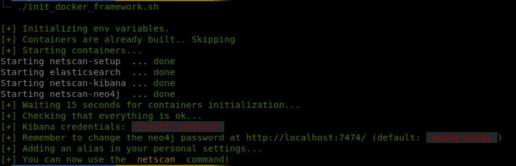

<div style="text-align:center"></div>
<p align="center">
  Network scanner made for large-scope pentesting
  <br>
  <a href="https://twitter.com/intent/follow?screen_name=hegusung" title="Follow"></a>
  <br>
</p>

# NetScan

## Features

- [x] FTP scanner
- [x] MySQL scanner
- [x] MonDB scanner
- [x] Ping scanner
- [x] Port scanner
- [x] Postgres scanner
- [x] RDP scanner
- [x] Redis scanner
- [x] Rsync scanner
- [x] RTSP scanner
- [X] SMB scanner
- [X] SSH scanner
- [X] Telnet scanner
- [X] VNC scanner
- [X] WinRM scanner
- [X] AD scanner
- [X] HTTP scanner
- [X] DNS scanner

## 1. Installation

### 1.0 Automagic installation

Run the following command and enjoy immediately..
```bash
$> bash run-netscan.sh
```



### 1.1 Manual installation with Docker

1. Start containers with `docker-compose`
   ```bash
   $> docker-compose up --remove-orphans --build -d
   ```
2. Run command from docker
   ```bash
   $> docker exec -it netscan-tool bash
   or
   $> docker exec -it netscan-tool python smbscan.py $SUBNET -w 100
   ```
### 1.2 Manual installation without Docker

1. Install dependencies
  ```bash
  $> pip3 install -r requirements.txt
  ```
2. Create the configuration file
  ```bash
  $> cp config.cfg.sample config.cfg
  ```
3. Install `Elasticsearch` and `Kibana`

## 2. Configuration
On your system or in the docker container, 

1. Edit the `config.cfg` file to set the name of your current pentest session under the `[Global]` section.

2. Enable elasticsearch if you want to send all your scan outputs to the database under the `[Elasticsearch]` section.

3. Configure the Kibana dashboards
   
   **Via GUI**  
     > The kibana dashboards are located at [kibana/kibana_dashboards.ndjson](kibana/kibana_dashboards.ndjson).

    - Open kibana at http://127.0.0.1:5601/
    - Go to "Management > Stack Management"
    - Go to "Kibana > Saved Objects"
    - Click on "Import"
    - Select the `kibana_dashboards.ndjson` file provided in this repo
    - Click on "Import"
  
   **Via CLI**  
   ```bash
   $> curl -X POST 'http://127.0.0.1:5601/api/saved_objects/_import?createNewCopies=true' -H "kbn-xsrf: true" --form "file=@$(pwd)/kibana/kibana_dashboards.ndjson"
   ```

4. The dashboards should now be available within Kibana


## 3. Troubleshooting

<hr/>

**Problem**: Elasticsearch has not enough memory-mapped areas to run smoothly.
**Solution** : Run the following command on you system (even for a dockerized environment)
```bash
sudo sysctl -w vm.max_map_count=262144
```
**Doc**: [https://www.elastic.co/guide/en/elasticsearch/reference/current/_maximum_map_count_check.html](https://www.elastic.co/guide/en/elasticsearch/reference/current/_maximum_map_count_check.html)

<hr/>

**Problem**: ??
**Solution** : Run the following commands on you system (even for a dockerized environment)
```bash
$> curl -X PUT -H "Content-Type: application/json" http://localhost:9200/_all/_settings -d '{"index.blocks.read_only_allow_delete": null}'
$> curl -X PUT -H "Content-Type: application/json" http://localhost:9200/_cluster/settings -d '{ "transient": { "cluster.routing.allocation.disk.threshold_enabled": false } }'
```

<hr/>