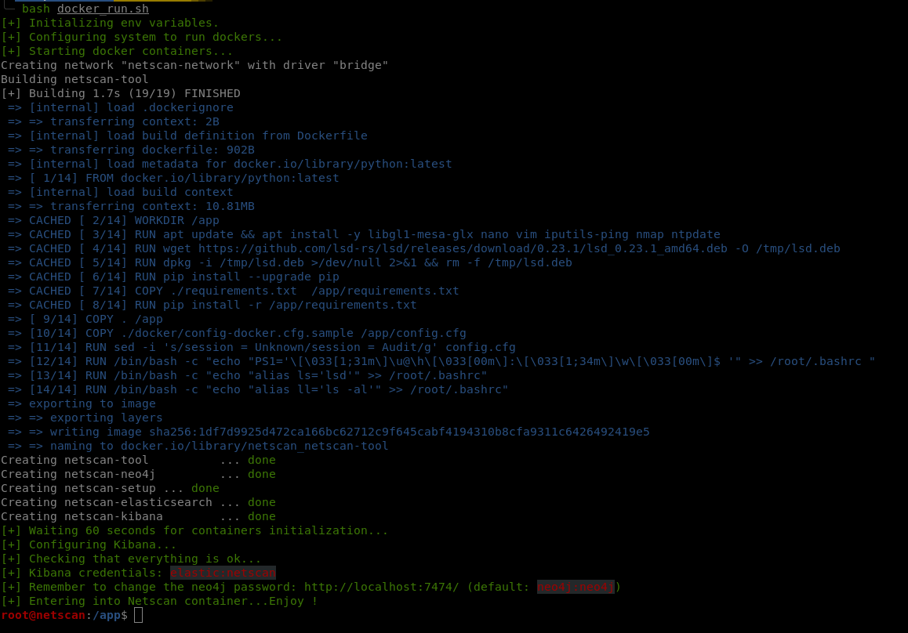

<p align="center">
  
  <br>
  <a href="https://twitter.com/intent/follow?screen_name=hegusung" title="Follow"></a>
  <br>
</p>

# NetScan

> Netscan is a network scanner made for large-scope pentesting. 
> It lets you scan and do your recon phase on more that 20+ protocols very quickly. All results are store in an elasticsearch database and browsable with the Kibana power.
> Scan, Filter, Exploit !

## Features

- [x] Everything is stored in Elasticsearch. Data is visible via Kibana
- [x] Active Directory
  - [x] Enumeration
  - [x] Active Directory attacks
  - [X] Active Directory modifications
  - [x] Active Directory Certificate Services
  - [x] Bloodhound export
  - [x] Modules
    - [x] ZeroLogon (CVE-2020-1472)
    - [x] NoPAC (CVE-2021-42278 / CVE-2021-42287)
    - [x] Check if ZONE_UPDATE_INSECURE parameter is enabled
    - [x] Check for LDAP signing and channel binding
- [x] Ping scanner
- [x] Port scanner
  - [x] Nmap service detection
  - [x] Nmap scripts executions
- [x] FTP scanner
  - [x] FTP authentication
  - [x] FTP multi-host bruteforce
  - [x] FTP listing
- [x] MySQL scanner
  - [x] MySQL authentication
  - [x] MySQL multi-host bruteforce
  - [x] MySQL database listing
  - [x] MySQL queries
- [x] MsSQL scanner
  - [x] MsSQL authentication
  - [x] MsSQL multi-host bruteforce
  - [x] MsSQL database listing
  - [x] MsSQL queries
  - [x] MsSQL command execution
- [x] MongoDB scanner
  - [x] MongoDB authentication
  - [x] MongoDB multi-host bruteforce
  - [x] MongoDB database listing
- [x] Postgres scanner
  - [x] Postgres authentication
  - [x] Postgres multi-host bruteforce
  - [x] Postgres database listing
  - [x] Postgres command execution
- [x] Redis scanner
  - [x] Redis authentication
  - [x] Redis multi-host bruteforce
  - [x] Redis RCE detection       
- [x] RDP scanner
  - [x] RDP authentication (does not mean you have rdp access)
  - [x] Modules
    - [x] Bluekeep (CVE-2019-0708) detection
- [x] VNC scanner
  - [x] VNC authentication
  - [x] VNC multi-host bruteforce
  - [x] VNC rubber-ducky execution
  - [x] VNC screenshot
- [x] Telnet scanner
  - [x] Telnet authentication
  - [x] Telnet multi-host bruteforce
  - [x] Telnet command execution      
- [x] SSH scanner
  - [x] SSH authentication
  - [x] SSH multi-host bruteforce
  - [x] SSH command execution
  - [x] Modules
    - [x] LinPEAS
    - [x] DirtyPipe (CVE-2022-0847)
    - [x] Get kernel and packages versions
    - [x] List network interfaces
    - [x] PwnKit vulnerability (CVE-2021-4034)
- [x] WinRM scanner
  - [x] WinRM authentication
  - [x] WinRM multi-host bruteforce
- [x] Rsync scanner
- [x] RTSP scanner
  - [x] Screenshot
- [x] SNMP scanner
  - [x] SNMP authentication
  - [x] SNMP multi-host bruteforce
  - [x] SNMP enumeration
- [X] TLS scanner 
- [X] DNS scanner
  - [x] DNS queries
  - [x] Reverse-DNS queries
  - [x] Subdomain bruteforce
  - [x] AXFR transfer
  - [x] Domain Controller detection
- [x] SMB scanner
  - [x] SMB authentication
  - [x] SMB multi-host bruteforce (be careful not to block accounts...)
  - [x] SMB shared folder listing
  - [x] SMB enumeration
  - [x] SMB secrets collection (SAM, LSA secrets)
  - [x] SMB command execution
  - [x] SMB modules
    - [x] EternalBlue detection (MS17-010)
    - [x] SambaCry detection (CVE-2017-7494)
    - [x] DropTheMic detection (CVE-2019-1040)
    - [x] SMBGhost detection (CVE-2020-0796)
    - [x] PetitPotam exploit (CVE-2021-36942)
    - [x] PrintNightmare vulnerability (CVE-2021-1675)
    - [x] PrintSpooler service detection
    - [x] DFSCoerce
- [x] HTTP scanner
  - [x] HTTP service header and page title enumeration
  - [x] HTTP authentication
  - [x] HTTP modules
    - [x] Axis2
    - [x] Tomcat
    - [x] JBoss
    - [x] Heartbleed
    - [x] Jenkins
    - [x] PhpMyAdmin
    - [x] And more !  


## Screenshots

Display the global help menu


Display a specific module help menu


Run a ping scan to discover devices in the network


Run a port scan to get all opened ports with the nmap options


Display the result in a way-to-cool interface!


## 1. Installation

### 1.0 Automagic installation (with docker)

> Run the following command and enjoy immediately..

```bash
~/netscan$> ./configure_docker.sh
```

The previous command will build and/or start all the framework docker containers used by netscan.
It will create and configure : 
* an elasticsearch container
* a kibana container
* a neo4j container



When everything is up and running, you can use the ` netscan ` command and enjoy.

### 1.1 Manual installation (without Docker)

1. Install dependencies
  ```bash
  $> pip3 install -r requirements.txt
  ```
2. Create the configuration file
  ```bash
  $> cp config.cfg.sample config.cfg
  ```
3. If needed, deploy `Elasticsearch` and `Kibana` on your systema.

## 2. Configuration
> **Note**:  
> The docker version is already configured with default settings. You're good to go.

On your system or in the docker container, 

1. Edit the `config.cfg` file to set the name of your current pentest session under the `[Global]` section.

2. Enable elasticsearch if you want to send all your scan outputs to the database under the `[Elasticsearch]` section.

3. Configure the Kibana dashboards
   
   **Via GUI**  
     > The kibana dashboards are located at [kibana/kibana_dashboards.ndjson](kibana/kibana_dashboards.ndjson).

    - Open kibana at http://127.0.0.1:5601/
    - Go to "Management > Stack Management"
    - Go to "Kibana > Saved Objects"
    - Click on "Import"
    - Select the `kibana_dashboards.ndjson` file provided in this repo
    - Click on "Import"
  
   **Via CLI**  
   ```bash
   $> curl -X POST 'http://127.0.0.1:5601/api/saved_objects/_import?createNewCopies=true' -H "kbn-xsrf: true" --form "file=@$(pwd)/kibana/kibana_dashboards.ndjson"
   ```

  The dashboards should now be available within Kibana


## 3. Troubleshooting

<hr/>

**Problem**: Elasticsearch has not enough memory-mapped areas to run smoothly.  
**Solution** : Run the following command on you system
```bash
sudo sysctl -w vm.max_map_count=262144
```
**Doc**: [https://www.elastic.co/guide/en/elasticsearch/reference/current/_maximum_map_count_check.html](https://www.elastic.co/guide/en/elasticsearch/reference/current/_maximum_map_count_check.html)

<hr/>

**Problem**: Elastic needs at least 10% free space of your hard disk (whatever the disk size). 
**Solution** : You can disable the disk size threshold by running the following commands on you system
```bash
$> curl -X PUT -H "Content-Type: application/json" http://localhost:9200/_cluster/settings -d '{ "transient": { "cluster.routing.allocation.disk.threshold_enabled": false } }'
```

<hr/>
